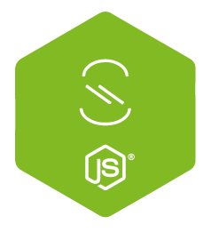

<p align="center"></p>
<p align="center">
  <strong>AsyncAPI Node.js<br>Code Generator</strong>
</p>
<p align="center">
  <em>Use your AsyncAPI definition to<br> generate the code for your API.</em>
</p>
<p align="center">
  
</p>
<br><br>


The generated code features:

- Default Node.js template, featuring:
  * ES7
  * ESLint
  * YAML config file
  * Hermes
  * No transpiling
- Custom templates. Check `--templates` option in the [Usage section](#usage). Kudos to [@jantoniucci](https://github.com/jantoniucci).

## Install

To use it from the CLI:

```bash
npm install -g asyncapi-node-codegen
```

To use it as a module in your project:

```bash
npm install --save asyncapi-node-codegen
```

## Usage

### From the command-line interface (CLI)

```bash
  Usage: anc [options] <asyncAPI>


  Options:

    -V, --version                  output the version number
    -o, --output <outputDir>       directory where to put the generated files (defaults to current directory)
    -t, --templates <templateDir>  directory where templates are located (defaults to internal nodejs templates)
    -h, --help                     output usage information
```

#### Examples

The shortest possible syntax:
```bash
anc asyncapi.yaml
```

Specify where to put the generated code:
```bash
anc asyncapi.yaml -o ./my-api
```

Specify where to find the code templates:
```bash
anc asyncapi.yaml -t ../my-specific-templates-dir -o ./my-api
```

### As a module in your project

```js
const path = require('path');
const codegen = require('asyncapi-node-codegen');
const asyncapi = '/path/to/asyncapi.yaml'; // Or a path to a JSON file

codegen.process(asyncapi, path.resolve(__dirname, './my-api')).then(() => {
  console.log('Done!');
}).catch(err => {
  console.error(`Something went wrong: ${err.message}`);
});
```

#### Using async/await

The function `codegen.process` returns a Promise, so it means you can use async/await:

```js
const path = require('path');
const codegen = require('asyncapi-node-codegen');
const asyncapi = '/path/to/asyncapi.yaml'; // Or a path to a JSON file

try {
  await codegen.process(asyncapi, path.resolve(__dirname, './my-api'));
  console.log('Done!');
} catch (err) {
  console.error(`Something went wrong: ${err.message}`);
}
```

## Author

Fran Méndez ([@fmvilas](http://twitter.com/fmvilas))
